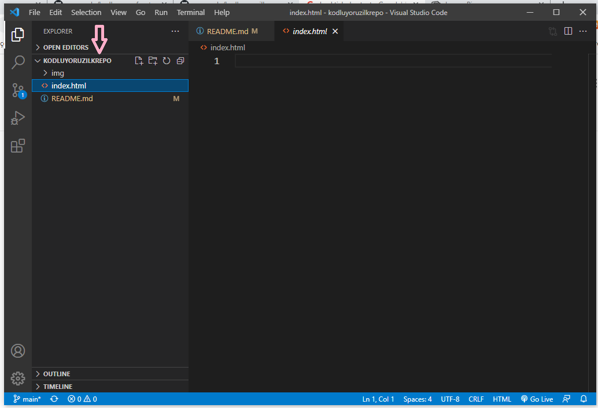

# Kodluyoruz İlk Repo
Bu repo Kodluyoruz Fron-End Eğitiminde açtığım ilk repo. İçerisinde 1 adet README dosyası, 1 adet de index.html dosyası barındırıyor.

## Installation

Öncelikle projeyi klonlayın. (https://github.com/mseroglu/kodluyoruzilkrepo.git)
```
git clone https://github.com/mseroglu/kodluyoruzilkrepo.git
```

## Usage 
Projeyi klonladıktan sonra Visual Studio Code programında açınız.

Linux için:
```
cd kodluyoruzilkrepo
code .
```
## Project Photo


### Contributing 
Pull requestler kabul edilir. Büyük değişiklikler için, lütfen önce neyi değiştirmek istediğinizi tartışmak için bir konu açınız.


### License
[MIT](./LICENSE)
